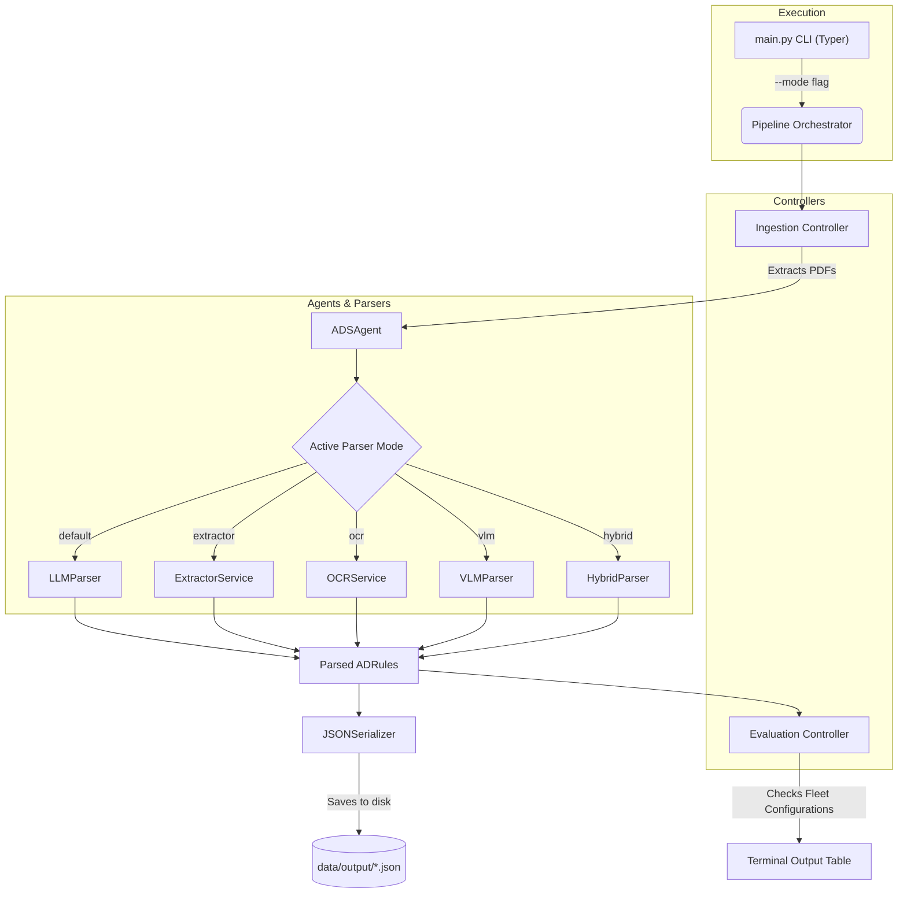

# Airworthiness Directives Pipeline

This document outlines the pipeline for processing Airworthiness Directives (ADs).

## Pipeline Flowchart

## Pipeline Explanation

The pipeline is designed to ingest, process, and extract information from Airworthiness Directives.

1.  **CLI Entry (`main.py`)**: A Typer application that accepts a `--mode` flag (default, extractor, ocr, vlm, hybrid) and defines the `AircraftConfiguration` fleet.
2.  **Pipeline Orchestration (`core/pipeline.py`)**: Manages the end-to-end execution of Ingestion, Parsing, and Evaluation.
3.  **Ingestion (`controller/ingestion.py`)**: Reads all files from `data/raw` and creates `Document` objects.
4.  **Parsing & AI Analysis (`agent/ads_agent.py`)**: 
    *   **LLM Parser (default)**: Uses Gemini 2.5 Pro to extract structured constraints (`ADRules`) based on the YAML prompt.
    *   **Fallback/Alternate Modes**: `ExtractorService` (raw text only), `OCRService` (pytesseract), `VLMParser` (unimplemented), `HybridParser` (unimplemented).
5.  **Serialization (`utils/json_serializer.py`)**: Converts the parsed `ADRules` into JSON and saves them to `data/output/`.
6.  **Evaluation (`controller/evaluation.py`)**: Evaluates the `ADRules` constraints against the fleet list looking at `model`, `msn`, and `modifications` exclusions using regex. Outputs 'Affected', 'Not affected', or 'Not applicable'.

## Current State
The project successfully orchestrates complete end-to-end reads using the `LLMParser` against Gemini APIs, extracting MSNs, aircraft models, and equipment modifications. Results are printed visually into the terminal and structured via JSON drops.
